## 🎥 Demo Video

<a href="https://drive.google.com/file/d/1-VWvtRLQaE0Ic6-zwmVFBYLLPHOKgNwj/view?usp=drive_link" target="_blank">Watch Full Demo Video</a>

# Agentic HR — AI-Powered Recruitment Pipeline

An end-to-end autonomous recruitment pipeline built with multi-agent AI. The system replaces repetitive HR coordination tasks with a chain of specialised AI agents, each handling one stage of the hiring process — while keeping humans in control at every decision point through built-in approval gates.

---

## What This Project Does

A recruiter uploads a job description and a batch of resumes. From that moment, a multi-agent pipeline takes over:

1. **Orchestrator Agent** receives the trigger and coordinates the entire pipeline, routing work between specialised agents and surfacing decisions to the recruiter when human judgment is needed.

2. **Resume Shortlister Agent** reads every resume, scores each candidate against the job description, and produces a ranked shortlist of 10–15 candidates with a match score and selection rationale for each. The shortlist is sent to the recruiter for approval (HITL gate).

3. **Pre-Screening Call Agent** — after the recruiter approves the shortlist — calls each shortlisted candidate over the phone using a live AI voice agent. It conducts a natural conversation and collects: job change intent, reason for change, current CTC, expected CTC, and availability for an interview slot. The collected data is sent back to the recruiter for approval (HITL gate).

4. **Interview Scheduler Agent** takes the approved pre-screening results, checks the recruiter's Google Calendar for availability, finds the first free 1-hour block within the candidate's declared window, creates a Google Calendar event with a Google Meet link, and sends professional confirmation emails to both the candidate and the recruiter.

5. **Background Verification Agent** *(planned)* initiates and tracks BGV checks once the interview stage is cleared.

6. **Onboarding Agent** *(planned)* handles all post-offer onboarding logistics — document collection, system access, induction scheduling, etc.

> In the future this pipeline can be extended with offer management, multiple interview rounds, ATS integrations, custom screening questionnaires, and per-company workflow configuration. The architecture is built to support that from day one.

---

## Architecture

```
                        ┌─────────────────────────────────┐
                        │         RECRUITER / HR           │
                        │  (uploads JD + resumes, reviews │
                        │   shortlists, approves results)  │
                        └────────────┬────────────────────┘
                                     │  trigger
                                     ▼
                        ┌─────────────────────────────┐
                        │      Orchestrator Agent      │
                        │  (LangGraph StateGraph)      │
                        │  routes between agents,      │
                        │  manages state & checkpoints │
                        └──────────┬──────────────────┘
                                   │
              ┌────────────────────┼────────────────────┐
              │                    │                     │
              ▼                    ▼                     ▼
  ┌───────────────────┐  ┌──────────────────┐  ┌─────────────────────┐
  │  Resume           │  │  Pre-Screening   │  │  Interview          │
  │  Shortlister      │  │  Call Agent      │  │  Scheduler Agent    │
  │  Agent            │  │                  │  │                     │
  │                   │  │  • Twilio calls  │  │  • Checks Google    │
  │  • Parses PDF/    │  │  • AI voice      │  │    Calendar (OAuth) │
  │    DOCX resumes   │  │    (Edge TTS)    │  │  • Finds free 1-hr  │
  │  • Scores vs JD   │  │  • STT via       │  │    block in window  │
  │  • Ranks top 15   │  │    <Gather>      │  │  • Creates event +  │
  │  • Cohere LLM     │  │  • Collects CTC, │  │    Google Meet link │
  └────────┬──────────┘  │    reason,       │  │  • Sends emails via │
           │             │    availability  │  │    Gmail API        │
           ▼             └────────┬─────────┘  └─────────────────────┘
  ┌─────────────────┐            │
  │  HITL Gate 1    │            ▼
  │  Recruiter      │   ┌─────────────────┐
  │  approves /     │   │  HITL Gate 2    │
  │  rejects        │   │  Recruiter      │
  │  shortlist      │   │  approves /     │
  └─────────────────┘   │  rejects call   │
                        │  results        │
                        └─────────────────┘
                                 │
              ┌──────────────────┼──────────────────┐
              ▼                  ▼                   ▼
  ┌───────────────────┐  ┌──────────────┐  ┌──────────────────┐
  │  Background       │  │  Onboarding  │  │  (Future)        │
  │  Verification     │  │  Agent       │  │  Offer Mgmt,     │
  │  Agent (planned)  │  │  (planned)   │  │  Multi-round     │
  │                   │  │              │  │  interviews,     │
  │  • BGV checks     │  │  • Documents │  │  ATS integration │
  │  • Track status   │  │  • Access    │  └──────────────────┘
  └───────────────────┘  │  • Induction │
                         └──────────────┘
```

---

## Demo Screenshots

The screenshots below follow a real end-to-end run in sequence — from uploading files to workflow completion, including the clickable step-history drawers and the HTML run log.

**1. Upload screen — clean landing page, drop zones for JD and resumes**
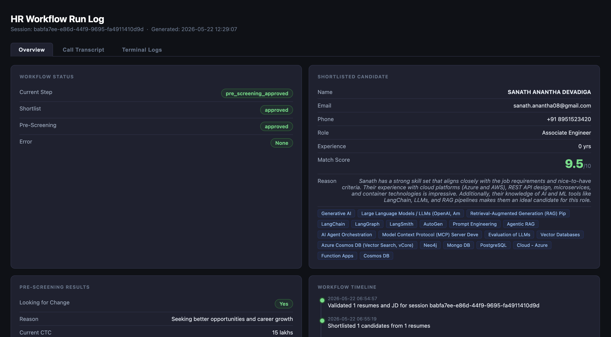

**2. Files selected — JD and 3 candidate resumes ready to launch**
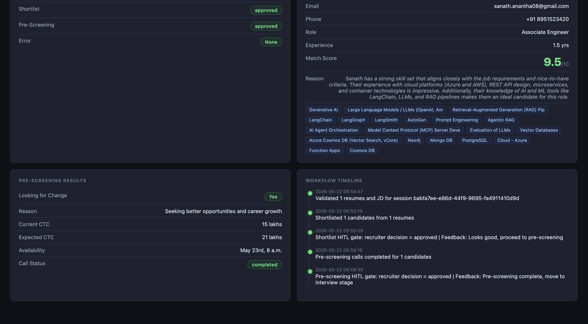

**3. Resume Parser agent active — pipeline nodes light up, parsing in progress**
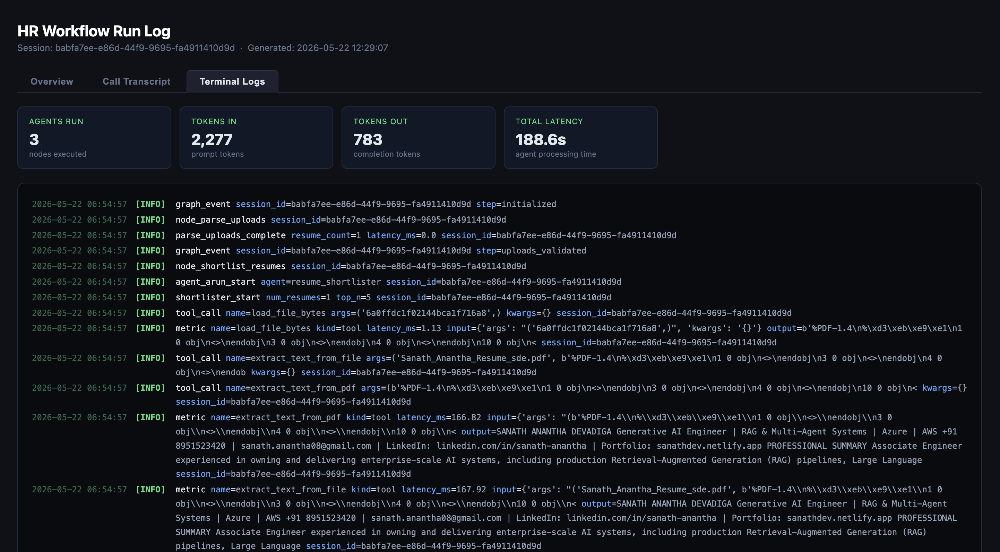

**4. HITL Gate 1 — shortlisted candidates with match scores, awaiting recruiter approval**
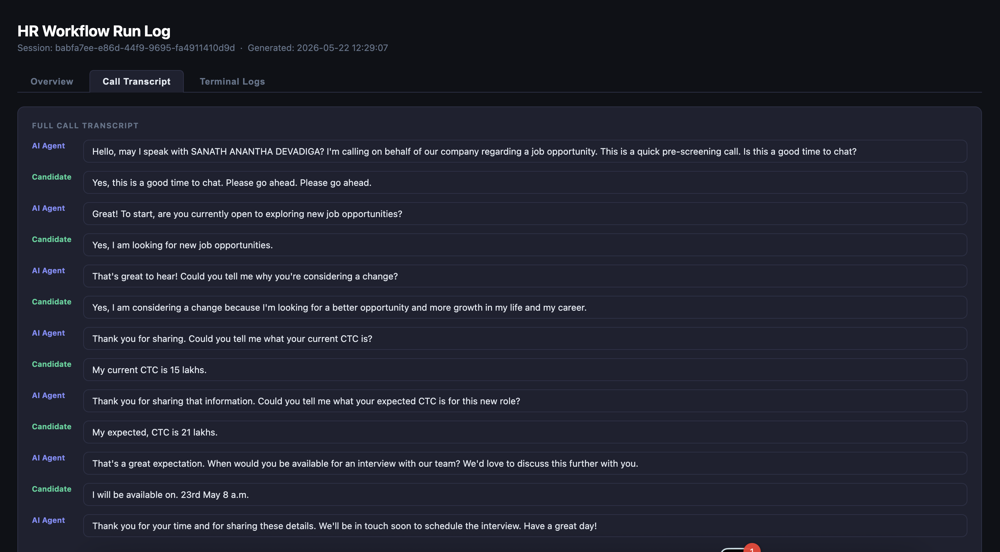

**5. Pre-Screening Calls — AI voice agent calling candidates sequentially (1 of 2 done)**
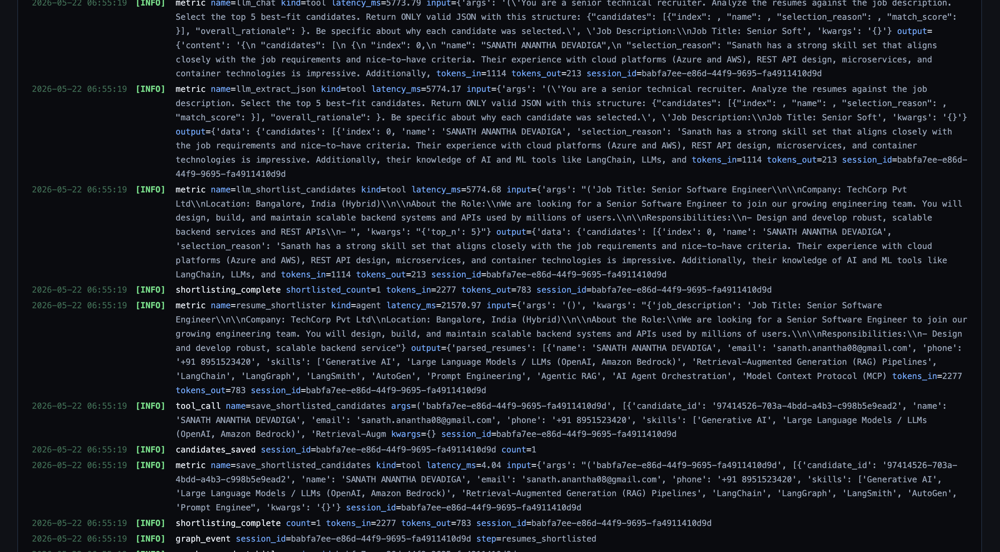

**6. HITL Gate 2 — pre-screening results collected, recruiter reviews before completing**
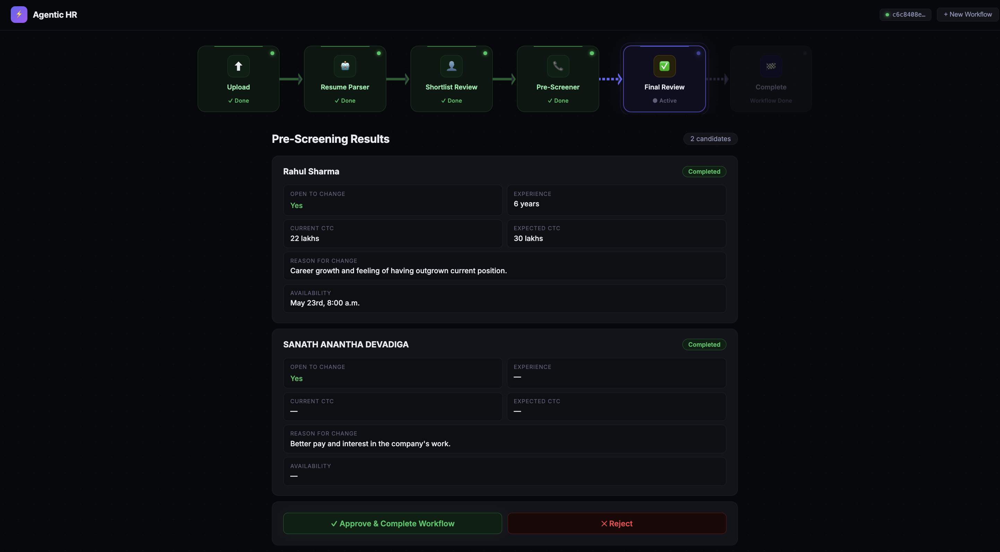

**7. Workflow Complete — all pipeline nodes green, run log ready to open**
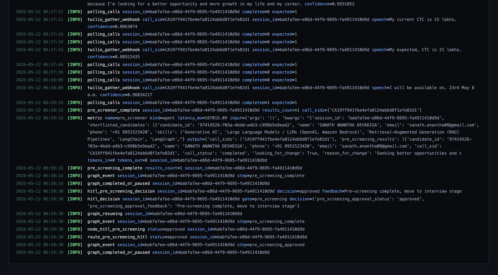

**8. HTML Run Log — Overview tab with candidate summary, screening data, and workflow timeline**
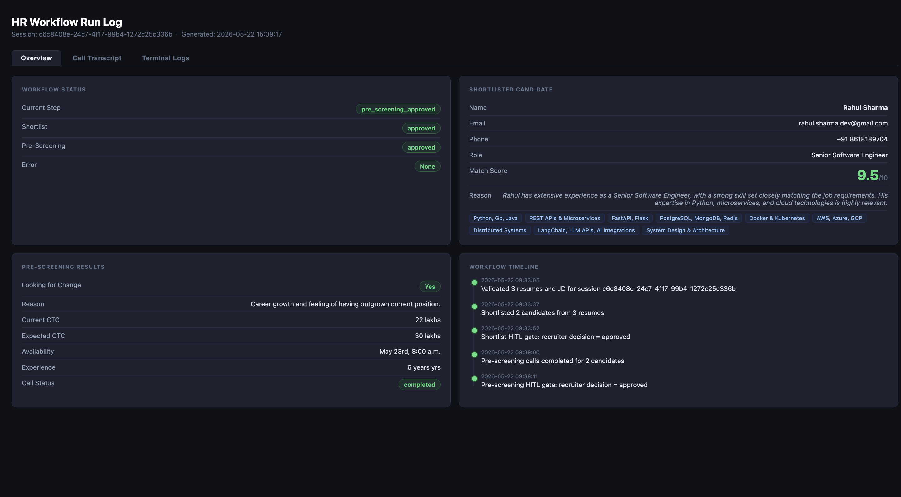

**9. HTML Run Log — Call Transcript tab showing the full AI-conducted conversation**
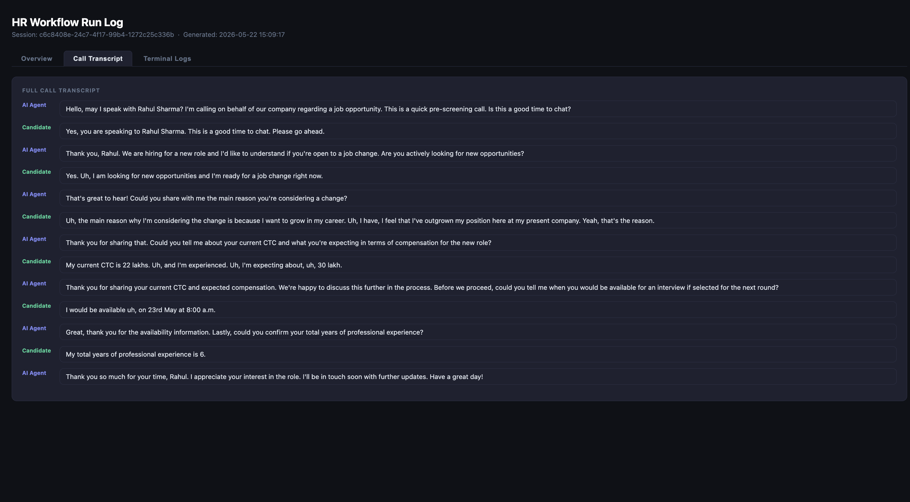

**10. Step history drawer — clicking a done node shows Resume Analysis data inline**
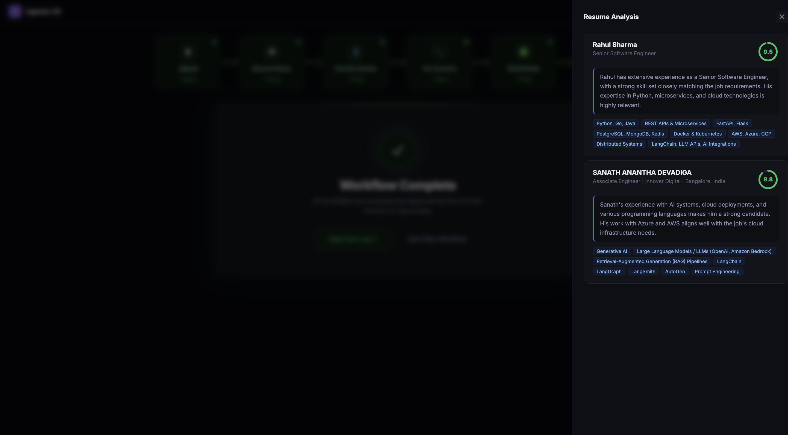

**11. Step history drawer — Shortlist Approval decision and AI rationale**
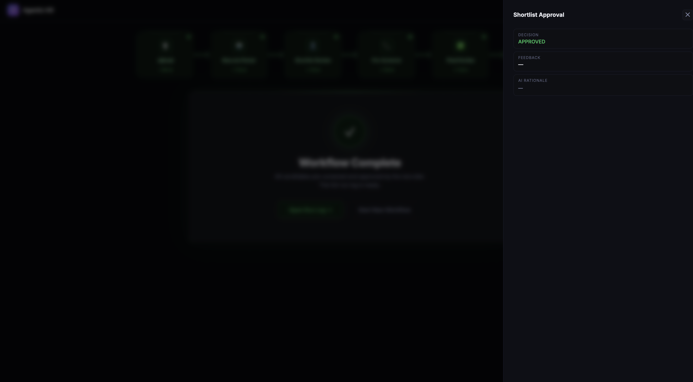

**12. Step history drawer — Pre-Screening Calls results for all candidates**
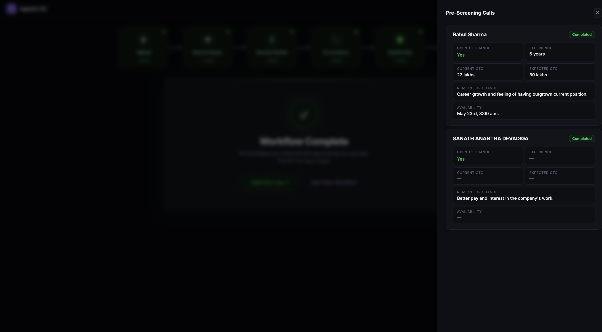

**13. Complete Run log**
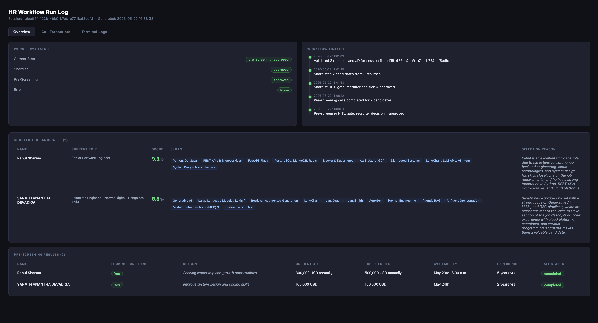

**14. HITL Gate 2 (Final Review) — Pre-screening results displayed with candidate's CTC, experience, reason for change, and declared interview slots. Recruiter clicks "Approve & Schedule Interviews" to trigger the scheduler.**
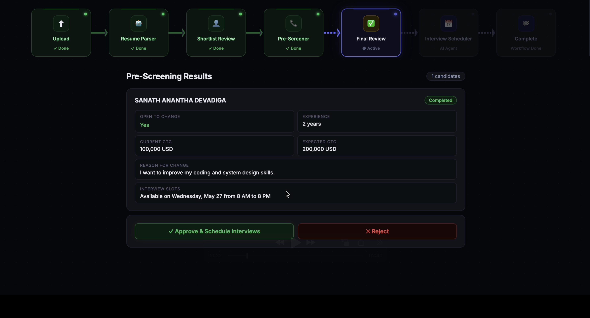

**15. Interview Scheduler Agent active — agent checks the recruiter's Google Calendar for available 1-hour slots within the candidate's declared window and queues confirmation emails.**
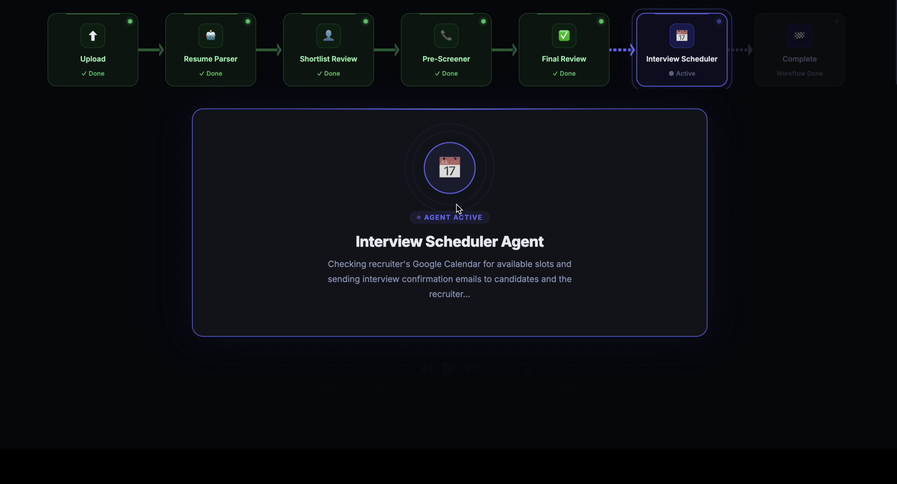

**16. Workflow Complete — all pipeline nodes green. Interview scheduled for 1 candidate; confirmation emails dispatched to both candidate and recruiter.**
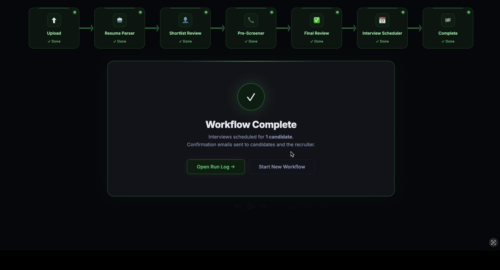

**17. Candidate's inbox — professional Round 1 interview confirmation email sent from the HR agent account, showing date, time, duration, mode (Google Meet), and the live meeting link.**
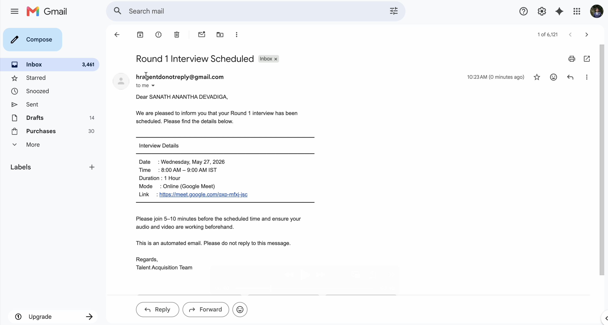

**18. Recruiter's inbox — Google Calendar invite received for the interview, with a "Join with Google Meet" button and the meeting link visible directly in the email.**
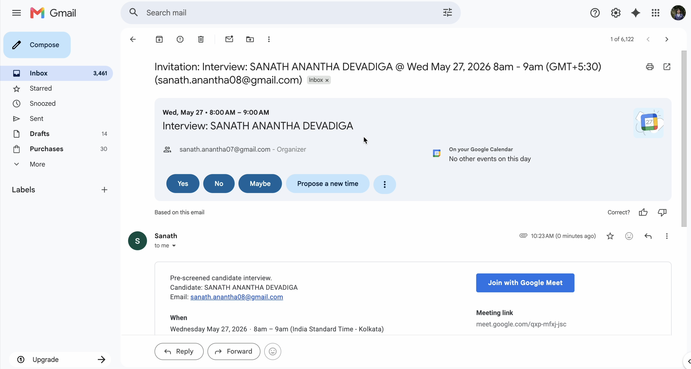

**19. Recruiter's Google Calendar — 1-hour interview event ("Interview: SANATH ANANTHA DEVADIGA, 8–9am") created automatically on the correct date, with the Google Meet link attached.**
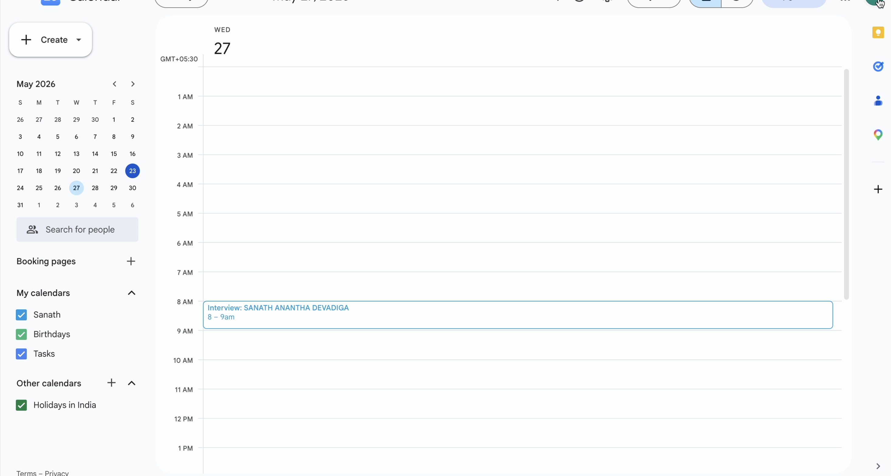

---

## What's Built and Working Today

### ✅ Resume Shortlister Agent

- Accepts a job description and up to 100 resumes (PDF or DOCX) via REST API
- Extracts full text from each file using `pdfplumber` and `python-docx`
- Sends all resumes + JD to Cohere (`command-r-plus-08-2024`) in a single LLM call
- Returns a ranked shortlist with: candidate name, email, phone, current role, years of experience, skills, match score (out of 10), and a written selection rationale
- Pauses at a HITL gate and waits for the recruiter to approve or reject the shortlist via API

### ✅ Pre-Screening Call Agent

- Dials each approved candidate using a Twilio outbound call
- Runs a live AI voice conversation powered by Edge TTS (Microsoft Neural, free) for speech synthesis and Twilio `<Gather input="speech">` for real-time transcription
- Collects all five pre-screening data points:
  - Is the candidate looking for a change?
  - Reason for change
  - Current CTC
  - Expected CTC
  - Availability / preferred interview slot
- Stores the full call transcript and extracted screening data in MongoDB
- Pauses at a second HITL gate for recruiter review before the pipeline continues

### ✅ Interview Scheduler Agent

- Triggered automatically after the recruiter approves pre-screening results at HITL Gate 2
- Parses each candidate's declared availability window (e.g., "Available on Wednesday, May 27 from 8 AM to 8 PM")
- Scans the window in **1-hour blocks** (8–9 AM, 9–10 AM, …) and checks the recruiter's Google Calendar via the **Freebusy API** for each block
- Books the **first free 1-hour slot** by creating a Google Calendar event on the recruiter's calendar
- Attaches a **Google Meet conference link** to the event (`conferenceData` with `hangoutsMeet`, `conferenceDataVersion=1`)
- Sends two professional confirmation emails via the **Gmail API**:
  - **Candidate email** — subject "Round 1 Interview Scheduled", includes date, time, duration, mode, and the Google Meet link
  - **Recruiter email** — interview summary with candidate details, slot, and Meet link
- Both emails are sent from a dedicated no-reply HR agent account (`hragentdonotreply@gmail.com`)
- All Google API access uses OAuth2 credentials (no service accounts needed); the token is refreshed automatically when expired

### ✅ End-to-End Run Completed

A real production run was completed end-to-end including interview scheduling:
- Resume: `Sanath_Anantha_Resume_sde.pdf`
- Candidate shortlisted with **9/10** match score
- Live Twilio call placed to `+918951523420`
- Full AI-conducted pre-screening conversation (5+ turns)
- All screening data collected, recruiter approved at both HITL gates
- Interview Scheduler found a free 1-hour slot (8–9 AM) on the recruiter's Google Calendar
- Google Calendar event created with a live Google Meet link (`meet.google.com/...`)
- Confirmation emails delivered to both candidate (`sanath.anantha08@gmail.com`) and recruiter (`sanath.anantha07@gmail.com`)
- HTML run log generated with overview, full call transcript, and captured terminal logs

---

## Changes Made on 23 May 2026

This section documents every change made to the system in today's session.

### 1. Interview Scheduler Agent — `agents/email_interview_scheduler.py` (new file)

A brand-new agent was built from scratch to handle the interview scheduling stage. Previously this was listed as "planned"; it is now fully operational.

**What it does:**
- Receives the list of pre-screened candidates (with their declared availability windows) from the graph state after HITL Gate 2 approval.
- For each candidate, it iterates through their availability window in **1-hour increments** using `check_slot_free()` to query the recruiter's Google Calendar.
- The first 1-hour block where the recruiter is free is selected.
- `create_calendar_event()` is called to create the event and generate a Google Meet link.
- `send_interview_emails()` dispatches confirmation emails to both the candidate and the recruiter.
- Logs every action (slot checked, slot busy, interview scheduled, emails sent) with structured JSON via `structlog`.

**Why 1-hour blocks?**
Previously the agent was booking the candidate's entire declared window (e.g., 8 AM–8 PM) as the interview duration, which was incorrect. The fix introduces a sliding 1-hour window scan so that the actual interview is exactly 1 hour and placed at the earliest free point in both parties' schedules.

---

### 2. Google Calendar Integration — `tools/calendar_tools.py` (new file)

Provides two functions used exclusively by the Interview Scheduler Agent:

**`check_slot_free(start_dt, end_dt) → bool`**
- Queries the recruiter's Google Calendar using the **Freebusy API** (`service.freebusy().query()`).
- Returns `True` if the recruiter has no events overlapping the given 1-hour window, `False` otherwise.
- Falls back to `True` (assume free) if Google credentials are not configured, so the system degrades gracefully in demo environments.

**`create_calendar_event(candidate_name, candidate_email, start_dt, end_dt) → str`**
- Creates a Google Calendar event on the recruiter's calendar (`calendarId = RECRUITER_CALENDAR_ID`).
- Includes both the recruiter and the candidate as attendees so Google sends native calendar invitations to both.
- Passes `conferenceData` with `conferenceSolutionKey: {type: "hangoutsMeet"}` and `conferenceDataVersion=1` to auto-generate a **Google Meet link**.
- After creation, extracts the Meet join URI from `conferenceData.entryPoints` (looking for `entryPointType == "video"`) and returns it. Falls back to the calendar event HTML link if no Meet entry point is found.
- All credentials are loaded from `google_token.json` (path set via `GOOGLE_TOKEN_PATH` in `.env`). The token is auto-refreshed using the stored `refresh_token` when it expires.

---

### 3. Gmail API Integration — `tools/email_tools.py` (new file)

Handles sending confirmation emails via the **Gmail API** (OAuth2), replacing any SMTP/App Password approach. No separate email credentials are needed — the same `google_token.json` used for calendar access covers Gmail sending too (`gmail.send` scope).

**`send_interview_emails(candidate_name, candidate_email, start_dt, end_dt, calendar_link)`**
- Builds two separate emails: one for the candidate, one for the recruiter.
- Constructs raw MIME messages (`MIMEMultipart` + `MIMEText`) encoded as base64 and sends via `service.users().messages().send(userId="me", ...)`.
- The `From` address is always `hragentdonotreply@gmail.com` (the dedicated HR agent account).

**Professional email template (added today):**
- Subject: `Round 1 Interview Scheduled` (candidate) / `Round 1 Interview Confirmed — {name} | {date}` (recruiter)
- Body includes a formatted interview details block with `━` separators, showing: Date, Time, Duration (1 Hour), Mode (Online / Google Meet), and the Meet link.
- Closes with: *"This is an automated email. Please do not reply to this message."* and *"Regards, Talent Acquisition Team"*.
- If the Meet link is unavailable (e.g., calendar event creation failed), the link line reads: *"You will receive the meeting link shortly."*

---

### 4. Dedicated HR Agent Email Account

The agent email was changed from `sanath.anantha08@gmail.com` (a personal account) to **`hragentdonotreply@gmail.com`** — a dedicated account used solely for sending automated HR emails.

- `AGENT_EMAIL` constant in `email_tools.py` updated.
- `setup_google_auth.py` instructions updated to prompt sign-in as the new account.
- The OAuth token (`google_token.json`) must be regenerated by running `python setup_google_auth.py` and signing in as `hragentdonotreply@gmail.com`.
- The recruiter's Google Calendar (`sanath.anantha07@gmail.com`) must share "Make changes to events" access with this new agent account.

---

### 5. Google Calendar Access Setup

The recruiter's Google Calendar (`.07`) was configured to delegate write access to the agent account so it can:
- Query free/busy slots on the recruiter's calendar.
- Create interview events directly on the recruiter's calendar (so it appears natively, not as an external invite that requires acceptance).

**Required sharing level:** Settings → Sanath calendar → Share with specific people → `hragentdonotreply@gmail.com` → **"Make changes to events"**.

---

### 6. Graph & Workflow Updated — `graph/workflow.py`, `graph/nodes.py`, `graph/edges.py`

The LangGraph `StateGraph` was extended to wire in the new Interview Scheduler Agent:

- A new node `node_email_interview_scheduler` was added that calls `email_interview_scheduler_agent.arun(...)`.
- The routing edge after HITL Gate 2 (`pre_screening_hitl`) now routes to `node_email_interview_scheduler` on approval instead of terminating.
- On completion, the graph transitions to a final `emails_sent` step and marks the workflow complete.
- The frontend pipeline UI now shows a 7th node: **"Interview Scheduler"**, which lights up green after emails are sent.

---

## Tech Stack

| Layer | Technology |
|---|---|
| Agent orchestration | LangGraph `StateGraph` with `interrupt_before` HITL gates |
| LLM | Cohere `command-r-plus-08-2024` via `langchain-cohere` |
| Voice calls | Twilio outbound calls + `<Gather input="speech">` for STT |
| Text-to-speech | Edge TTS (Microsoft Neural, free) — served as MP3 from FastAPI `/static` |
| Calendar integration | Google Calendar API v3 (Freebusy + Events insert with Google Meet) |
| Email sending | Gmail API v1 (OAuth2, `gmail.send` scope) — no SMTP or App Passwords |
| Video conferencing | Google Meet — auto-generated via `conferenceData` on Calendar event creation |
| Google Auth | OAuth2 via `google-auth-oauthlib`; token stored in `google_token.json`, auto-refreshed |
| Database | MongoDB (`motor` async driver) + GridFS for file storage |
| API | FastAPI with async lifespan, static file serving |
| Logging | `structlog` JSON logging with per-session JSONL file sink |
| Observability | Latency + token tracking (`tokens_in`, `tokens_out`) on every LLM call |
| Retries | `tenacity` exponential backoff on all external calls |
| Validation | Pydantic v2 settings + request/response schemas |
| Webhook tunneling | `ngrok` for local Twilio webhook delivery |

---

## Project Structure

```
agentic-hr/
├── main.py                          # FastAPI app entry point
├── config/settings.py               # Pydantic settings (reads from .env)
├── core/
│   ├── logging.py                   # structlog setup + per-session file log sink
│   ├── observability.py             # @observe_agent, @observe_tool decorators
│   └── exceptions.py                # Custom exceptions + FastAPI error handlers
├── db/mongodb.py                    # All MongoDB operations (async / motor)
├── models/
│   ├── state.py                     # LangGraph HRWorkflowState TypedDict
│   └── schemas.py                   # Pydantic request/response schemas
├── tools/
│   ├── base.py                      # @tool_call, @with_retry decorators
│   ├── file_tools.py                # PDF/DOCX text extraction
│   ├── llm_tools.py                 # Cohere LLM wrappers
│   ├── call_tools.py                # Twilio outbound call initiator
│   ├── calendar_tools.py            # Google Calendar freebusy + event creation (NEW)
│   └── email_tools.py               # Gmail API email sender (NEW)
├── agents/
│   ├── resume_shortlister.py        # Resume parsing + LLM ranking node
│   ├── pre_screener.py              # Call orchestration + result polling node
│   └── email_interview_scheduler.py # Interview slot finder + email dispatcher (NEW)
├── graph/
│   ├── workflow.py                  # StateGraph definition + compilation
│   └── edges.py                     # Conditional routing after HITL gates
├── hitl/gates.py                    # HITL decision handlers (approve / reject)
├── voice/
│   ├── conversation.py              # TwiML state machine for live calls
│   └── tts.py                       # Edge TTS audio generation
├── api/endpoints/
│   ├── workflow.py                  # /workflow/* REST endpoints
│   ├── hitl.py                      # /hitl/* REST endpoints
│   └── webhooks.py                  # /webhooks/twilio/* Twilio callbacks
├── setup_google_auth.py             # One-time OAuth2 setup for Google APIs (NEW)
├── google_credentials.json          # OAuth client ID + secret from Google Cloud Console
├── google_token.json                # OAuth access + refresh token (generated by setup script)
├── generate_report.py               # HTML run log generator (3-tab report)
├── test_call.py                     # Standalone Twilio call tester
├── test_flow.sh                     # End-to-end bash test script
├── .env.example                     # Environment variable template
└── requirements.txt
```

---

## Setup

### 1. Install dependencies

```bash
python -m venv venv
source venv/bin/activate       # Windows: venv\Scripts\activate
pip install -r requirements.txt
```

### 2. Configure environment

```bash
cp .env.example .env
# Fill in your API keys
```

You need:
- **Cohere API key** — free at [cohere.com](https://cohere.com)
- **Twilio account** — free trial at [twilio.com](https://twilio.com) (verify your phone number in trial mode)
- **MongoDB** — local (`mongodb://localhost:27017`) or Atlas
- **Google Cloud project** — with Gmail API and Google Calendar API enabled; OAuth client ID downloaded as `google_credentials.json`

### 3. Set up Google OAuth (one-time)

```bash
# Run this once, sign in as hragentdonotreply@gmail.com when the browser opens
python setup_google_auth.py
```

This generates `google_token.json`. Set `GOOGLE_TOKEN_PATH=./google_token.json` in `.env`.

The recruiter's calendar must share **"Make changes to events"** access with `hragentdonotreply@gmail.com` via Google Calendar Settings.

### 4. Start ngrok

```bash
ngrok http 8000
# Paste the https URL into .env as PUBLIC_BASE_URL
```

Set your Twilio phone number's Voice webhook URL to:
```
https://<your-ngrok-url>/api/webhooks/twilio/voice
```

### 5. Run the server

```bash
python main.py
```

---

## Running the Workflow

### Option A — bash script (recommended)

```bash
bash test_flow.sh /path/to/resume.pdf
```

Walks through the full flow interactively: upload → shortlist review → HITL approve → call → HITL approve → schedule interview → complete.

### Option B — curl

```bash
# 1. Start workflow
curl -X POST http://localhost:8000/api/workflow/start \
  -F "jd_file=@job_description.txt" \
  -F "resume_files=@resume.pdf"

# 2. Check shortlist
curl http://localhost:8000/api/workflow/<session_id>/shortlist

# 3. Approve shortlist
curl -X POST http://localhost:8000/api/hitl/<session_id>/shortlist \
  -H "Content-Type: application/json" \
  -d '{"decision": "approved", "feedback": "Looks good"}'

# 4. Check pre-screening results
curl http://localhost:8000/api/workflow/<session_id>/pre-screening

# 5. Approve pre-screening (triggers interview scheduling automatically)
curl -X POST http://localhost:8000/api/hitl/<session_id>/pre-screening \
  -H "Content-Type: application/json" \
  -d '{"decision": "approved", "feedback": "Ready for interview"}'
```

### Generating the HTML Run Log

```bash
python generate_report.py <session_id>
open run_log_<first8chars>.html
```

The report has three tabs — **Overview** (candidate + screening summary), **Call Transcript** (full AI conversation), and **Terminal Logs** (every structlog JSON line captured during the run).

---

## Key Design Decisions

- **LangGraph `interrupt_before`** — HITL gates pause graph execution cleanly without polling or timeouts. `MemorySaver` holds checkpoint state in memory while MongoDB holds business data persistently across restarts.
- **Twilio + Edge TTS** — Twilio handles telephony (STT via `<Gather input="speech">`); Edge TTS generates the AI voice as MP3 served from FastAPI's `/static` endpoint, keeping voice costs at zero.
- **1-hour block scanning** — Rather than booking the candidate's entire declared window, the scheduler slides a 1-hour window across the availability range and picks the first slot where the recruiter's calendar is free. This ensures interviews are always exactly 1 hour and don't block the recruiter's whole day.
- **Google Meet via `conferenceData`** — Passing `conferenceData` with `conferenceSolutionKey: {type: "hangoutsMeet"}` and `conferenceDataVersion=1` to the Calendar Events insert API auto-generates a Meet link without requiring any additional API calls or Meet-specific credentials.
- **Single OAuth token for calendar + email** — Both the Google Calendar API and Gmail API share the same `google_token.json`. The token is issued with `calendar` + `gmail.send` scopes in one OAuth flow, so there is no credential sprawl.
- **Async-first** — All I/O is async (motor for MongoDB, async FastAPI). Twilio's sync SDK and Google's sync client libraries are wrapped with `run_in_executor` to avoid blocking the event loop.
- **TwiML XML escaping** — `&` between query params in TwiML `action` URLs must be escaped as `&amp;`; handled centrally by `_action_url()` in `voice/conversation.py`.
- **Per-session log files** — Every structlog line emitted during a workflow run is written to `logs/<session_id>.jsonl` via a custom processor inserted before `JSONRenderer`. The HTML report reads this file directly, giving you the exact terminal output in the browser.
